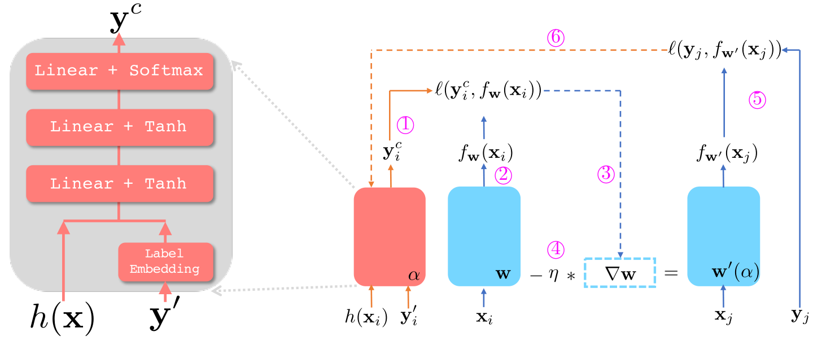

# Meta Label Correction for Noisy Label Learning

This repository contains the source code for the AAAI paper "Meta Label Correction for Noisy Label Learning".



## Data

The code will download automatically the CIFAR data set; for Clothing1M, please contact the [original creator](https://github.com/Cysu/noisy_label) for access. Put the obtained Clothing1M data set under directory ```data/clothing1M```. Execute 'cd CLOTHING1M; python3 load_cloth1m_data.py' to generate necessary folders for training.

## Example runs

On CIFAR-10 run MLC with UNIF noise and a noise level of 0.4 by executing
```python
python3 main.py --dataset cifar10 --optimizer sgd --bs 100 --corruption_type unif --corruption_level 0.4 --gold_fraction 0.02 --epochs 120 --main_lr 0.1 --meta_lr 3e-4 --runid cifar10_run  --cls_dim 128
```
On CIFAR-100, run MLC with FLIP noise and a noise level of 0.6 by executing
```python
python3 main.py --dataset cifar100 --optimizer sgd --bs 100 --corruption_type flip --corruption_level 0.6 --gold_fraction 0.02 --epochs 120 --main_lr 0.1 --meta_lr 3e-4 --runid cifar100_run  --cls_dim 128
```

On Clothing1M, run MLC as 
```python
python3 main.py --dataset clothing1m --optimizer sgd --bs 32 --corruption_type unif --corruption_level 0.1 --gold_fraction 0.1 --epochs 15 --main_lr 0.1 --meta_lr 3e-4 --runid clothing1m_run  --cls_dim 128
```
(Note that for clothing1m, ```corruption_type```, ```corruption_level```, and ```gold_fraction``` have no effect as the original dataset comes with actual noisy labels and clean/noisy data splits.)

Refer to ```python3 main.py --help``` for a detailed explanations of all applicable arguments.

## Citation

If you find MLC useful, please cite the following paper

```
@inproceedings{zheng2021mlc,
  title={Meta Label Correction for Noisy Label Learning},
  author={Zheng, Guoqing and Awadallah, Ahmed Hassan and Dumais, Susan},  
  journal={Proceedings of the AAAI Conference on Artificial Intelligence (AAAI)},
  volume={35},
  year={2021},
}
```
For any questions, please submit an issue or contact [zheng@microsoft.com](zheng@microsoft.com). 

This repository is released under MIT License. (See [LICENSE](LICENSE))
